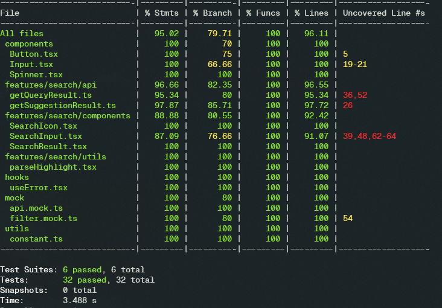
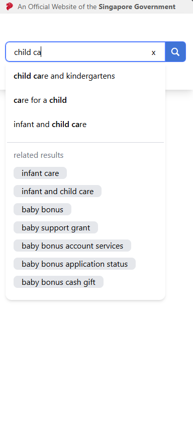
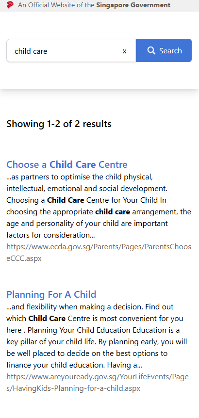

# Web Dev Tech Assignment for GovTech - 2025

A search portal SPA that allows users to search for information on the Government of Singapore's website.

This is a submission for the [GovTech's 2025 assignment](https://gist.github.com/yuhong90/b5544baebde4bfe9fe2d12e8e5502cbf).

## 💻 Table of Contents

- 🗄️ [Project Structure](#🗄️-project-structure)
- ⚙️ [Installation](#⚙️-installation)
- 🚄 [Run the App](#🚄-run-the-app)
- 🧪 [Run Unit Tests](#🧪-run-unit-tests)
- 🧱 [Technologies Used](#🧱-technologies-used)
- 📷 [Preview](#📷-preview)
- 📝 [Assumptions](#📝-assumptions)

## 🗄️ Project Structure

```
src
├───app                 # main application layer
│   └───routes          # pages
├───assets              # additional assets folder
├───components          # shared stateless UI components
├───features            # shared business logic components
│   └───feature
│       ├───components  # locally scoped components
│       └───...         # parts specified to the feature (api/, utils/)
├───hooks               # shared hooks
└───mock                # mock data
```

## ⚙️ Installation

- Node.js (version 18 and above)
- npm (comes with NodeJS)

1. Clone the repository

   ```bash
   git clone git@github.com:akitak1290/govtech-react-assignment.git
   cd govtech-react-assignment
   ```

2. Install dependencies

   ```bash
    npm install
   ```

## 🚄 Run the App

This will start a development server on port 5173 by default.

```bash
npm run dev
```

Open your browser and go to http://localhost:5173 (vite serves the app by default on port 5173)

## 🧪 Run Unit Tests

```bash
npm run test
```



Test library used:

- [Jest](https://jestjs.io/)
- [React Testing Library](https://testing-library.com/)

## 🧱 Technologies Used

- **Frontend**: ReactJS, Typescript
- **Build tool**: Vite
- **Testing tool**: React Testing Library, Jest

## 📷 Preview
- **Web view**\


- **Mobile view**\


- **Network error**\


## 📝 Assumptions
- Each suggestion needs to highlights all words in the search string individually.
- The mock data for query result only highlights the word 'child'. An additional filter has been added to dynamically change the highlights array to match the actual search word.